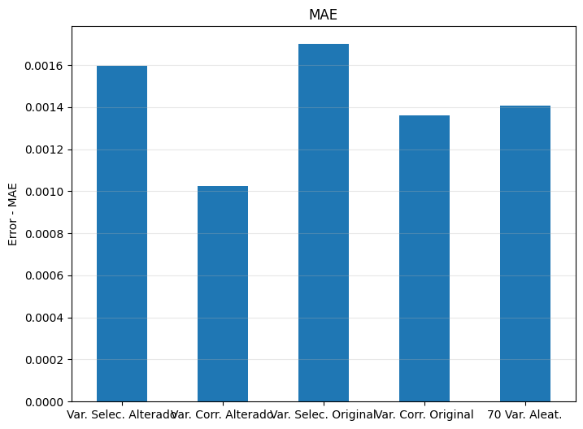
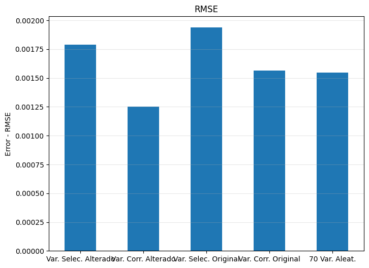
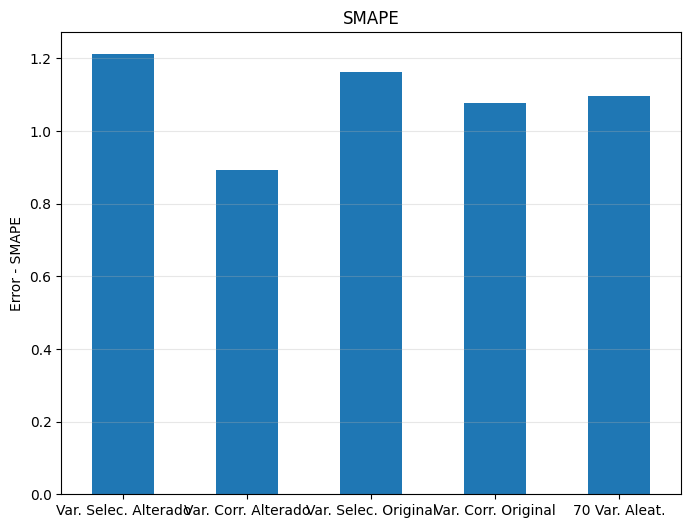
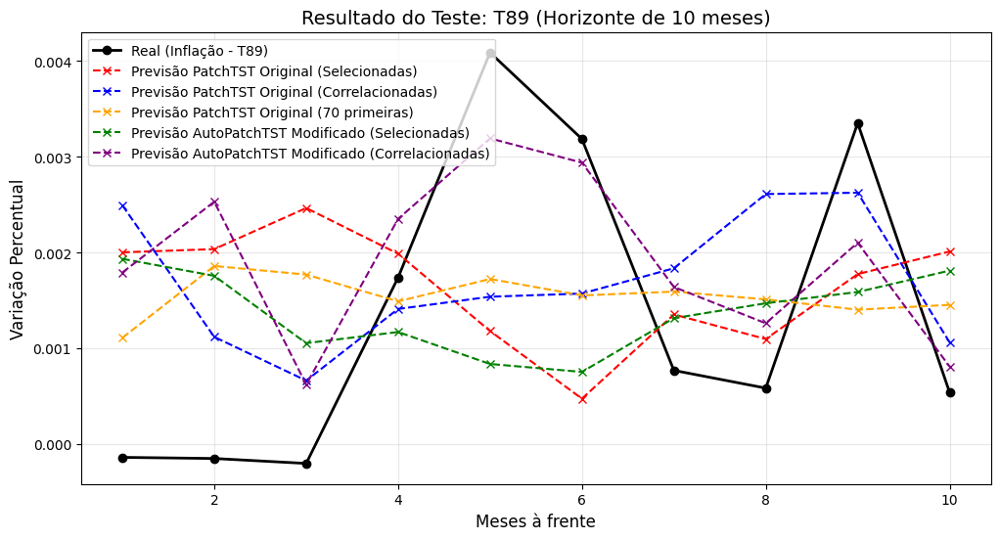

# MEISSA Final Project - Multivariate Forecasting with PatchTST

## Description

This project implements and compares different **multivariate forecasting** strategies using the **PatchTST** model on the **FRED-MD** dataset (Federal Reserve Economic Data). The goal is to forecast the macroeconomic variable **T89** by comparing models with standard configuration and automatic hyperparameter optimization (AutoML).

## 🏆 Results and Demonstration

The project compared 5 training scenarios. The **Modified AutoPatchTST model trained with the 5 most correlated variables** achieved the best absolute performance.

### Comparison of Error Metrics
The graphs below show that variable selection by correlation combined with hyperparameter optimization significantly reduced MAE, RMSE, and SMAPE.

### Test Result (10-month Horizon)
Below, the visual comparison between the forecasts of the different models and the actual values of the T89 variable. Note how the optimized model's curve (in purple) best follows the real trend.

---

## Context

This is the **final project** of the **MEISSA** training program, a partnership between the **Laboratório de Inteligência Artificial e Arquiteturas Dedicadas (LIAD)** of UFCG and **HP**. The project applies advanced knowledge in multivariate time series and model optimization.

## Technologies Used

- **Python 3.x**
- **NeuralForecast** - Specialized forecasting framework
- **AutoPatchTST** - Automatic hyperparameter optimization
- **Ray Tune** - Hyperparameter tuning framework
- **Sktime** - TSF dataset loading

## Methodology

1. **Dataset**: FRED-MD (107 macroeconomic variables).
2. **Scenarios**: Comparison between manual selection, correlation-based selection, and using 70 variables.
3. **Optimization**: Use of Ray Tune for hyperparameter search (learning rate, patch length, etc.).

## How to Run

Click the "Open in Colab" badge at the top of this README to run the notebook directly in your browser.

## Authors

- **Luiz Anselmo Medeiros Lima**
- **Anne Grazieli Marques Silva**
- **Pedro Henrique Coelho Torres**

## MEISSA Project

This project was developed as the **final project** of the **MEISSA** training program, a partnership between the **Laboratório de Inteligência Artificial e Arquiteturas Dedicadas (LIAD)** of UFCG and **HP**.
